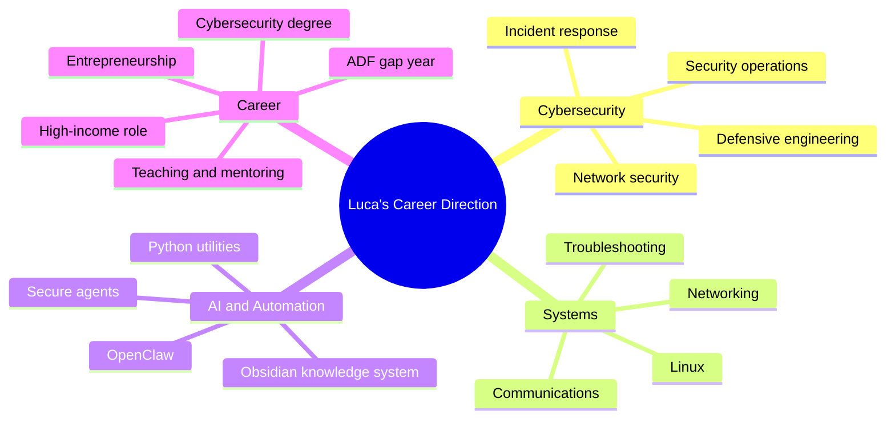
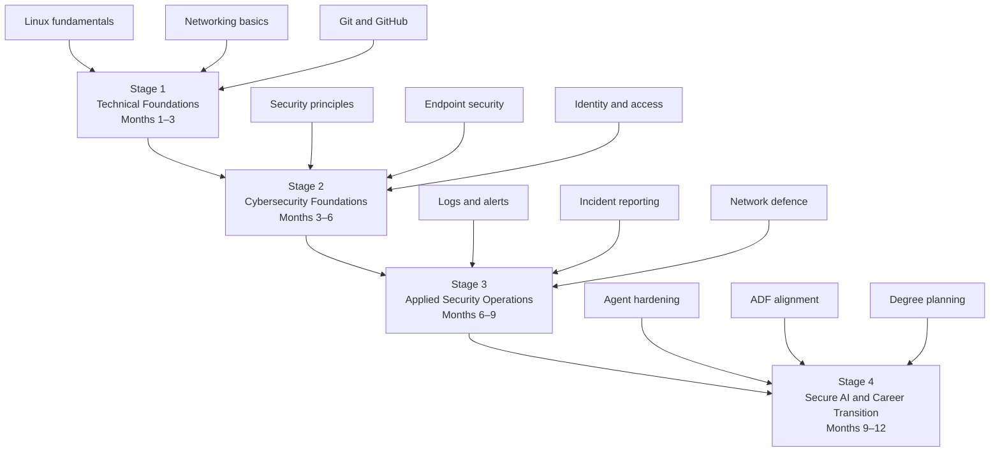
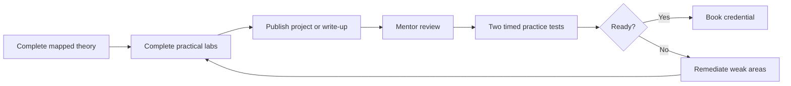
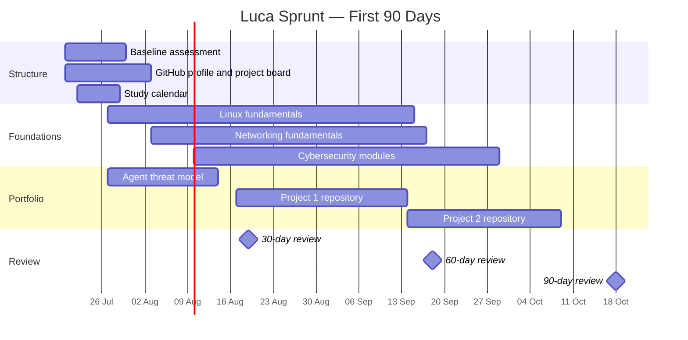
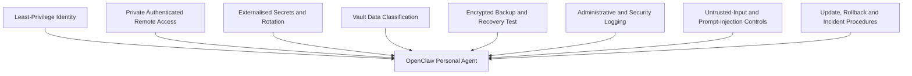
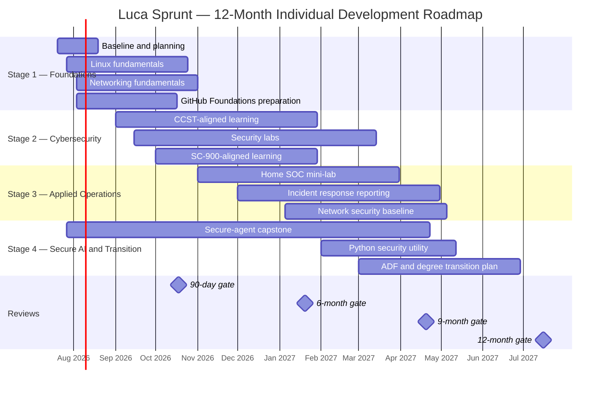
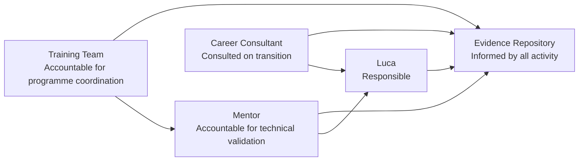

<div align="center">

<picture>
  <source media="(prefers-color-scheme: dark)" srcset="https://raw.githubusercontent.com/skunkworks-academy/.github/refs/heads/main/images/favicon-white.png">
  <source media="(prefers-color-scheme: light)" srcset="https://raw.githubusercontent.com/skunkworks-academy/.github/refs/heads/main/images/favicon-black.png">
  
</picture>

# Luca Sprunt — Individual Development Roadmap

### Cybersecurity Foundations · Systems Operations · Secure AI Automation

[](#development-profile)
[](#recommended-learning-pathway)
[](#12-month-execution-roadmap)
[](#review-gates)
[](#development-objectives-and-kpis)

**Prepared by Skunkworks Academy — Training and Career Development**  
**Roadmap period:** July 2026–June 2027  
**Primary contact:** [training@skunkworksacademy.com](mailto:training@skunkworksacademy.com)

</div>

---

> [!IMPORTANT]
> **Confidential development record.** This roadmap contains personal development information. Store it in a private repository or restrict access to Luca, his assigned mentor, the career consultant and authorised Skunkworks Academy personnel.

> [!NOTE]
> Several single-choice answers were not preserved in the copied Microsoft Forms export. This roadmap prioritises Luca’s written responses and must be validated during the first career consultation.

## Navigation

- [Executive summary](#executive-summary)
- [Development profile](#development-profile)
- [Career direction](#career-direction)
- [Strengths and development gaps](#strengths-and-development-gaps)
- [Recommended learning pathway](#recommended-learning-pathway)
- [Credential sequence](#credential-sequence)
- [First 90 days](#first-90-days)
- [Portfolio projects](#portfolio-projects)
- [Secure-agent controls](#secure-agent-minimum-controls)
- [Mentoring and community](#mentoring-feedback-and-community)
- [Objectives and KPIs](#development-objectives-and-kpis)
- [Risks and mitigations](#risks-and-mitigations)
- [Responsibilities](#roles-and-responsibilities)
- [Immediate actions](#immediate-next-actions)
- [Review and sign-off](#review-and-sign-off)

---

## Executive Summary

Luca is a **high-potential emerging learner** at the beginning of his technical career. His strongest indicators are initiative, curiosity, coachability and long-term ambition. He has already completed VCE Software Development 3/4, developed basic Python capability, begun Linux fundamentals, explored TryHackMe and initiated a locally hosted OpenClaw assistant integrated with an Obsidian vault.

His primary development requirement is not motivation. It is **structure**: a sequenced foundation in Linux, networking, security operations, technical documentation and safe systems engineering.

### Provisional placement

| Dimension | Placement |
|---|---|
| Development level | **Foundation Technical — High-Potential Emerging Learner** |
| Primary pathway | **Cybersecurity Foundations and Security Operations** |
| Secondary pathway | **Secure AI Automation and Technical Entrepreneurship** |
| Mentoring requirement | **High** |
| Core constraint | Year 12 workload and limited access to cybersecurity peers |
| Anchor capstone | Secure Personal Agent Baseline |

### One-year North Star

> By July 2027, Luca should have a documented cybersecurity foundation, an active and credible GitHub portfolio, two to three practical projects, at least one entry-level credential or equivalent validated learning milestone, regular mentor feedback, and a clear transition plan into the ADF communications environment and subsequent cybersecurity degree.

---

## Development Profile

### Readiness dashboard

| Capability | Rating | Visual | Interpretation |
|---|:---:|:---:|---|
| Motivation and initiative | 4/5 | `████░` | Strong |
| Career direction | 3/5 | `███░░` | Developing |
| Technical foundations | 2/5 | `██░░░` | Emerging |
| Applied practice | 2/5 | `██░░░` | Emerging |
| Portfolio evidence | 1/5 | `█░░░░` | Early |
| Mentorship readiness | 5/5 | `█████` | Very strong |
| Leadership potential | 3/5 | `███░░` | Developing |


---

## Candidate Snapshot

| Field | Detail |
|---|---|
| Name | Luca Sprunt |
| Current stage | Scholar / Year 12 learner |
| Primary interest | Cybersecurity |
| Related interests | AI, coding, Linux, automation, GitHub and systems operations |
| GitHub | [github.com/Luca-Sprunt](https://github.com/Luca-Sprunt) |
| LinkedIn | [linkedin.com/in/luca-sprunt-008a99417](https://www.linkedin.com/in/luca-sprunt-008a99417) |
| Credly | [credly.com/users/luca-sprunt](https://www.credly.com/users/luca-sprunt) |
| Portfolio status | Public portfolio requires development |
| Current project | Locally hosted OpenClaw assistant connected to an Obsidian knowledge vault |

> [!CAUTION]
> Personal contact details have intentionally been omitted from this README. Maintain them in the protected IDR record rather than in a public GitHub repository.

---

## Career Direction

### Immediate: next 12–24 months

- Complete Year 12 successfully.
- Build coherent Linux, networking and cybersecurity foundations.
- Establish a credible GitHub portfolio.
- Gain regular access to a cybersecurity mentor and peer cohort.
- Prepare for the ADF gap-year Communications Systems Operator programme.

### Medium term: 3–5 years

- Start and progress through a cybersecurity degree.
- Become credible in a defined security specialisation.
- Move toward a high-income technical role.
- Test and validate a viable technology business concept.

### Long term: 5+ years

- Complete the cybersecurity degree.
- Attain specialist and leadership capability.
- Operate a sustainable technology business.
- Teach, mentor and eventually employ others.

### Professional interest map



---

## Strengths and Development Gaps

<table>
<tr>
<td width="50%" valign="top">

### Strengths

| Strength | Evidence and value |
|---|---|
| Self-directed initiative | Started a local AI-agent project rather than waiting for a formal assignment. |
| Technical curiosity | Exploring Python, Linux, cybersecurity labs and AI-enabled workflows. |
| Leadership exposure | Operated a clothing brand and held school leadership roles. |
| Long-term ambition | Connects education, employability, entrepreneurship, teaching and job creation. |
| Coachability | Explicitly wants a mentor and acknowledges current uncertainty. |
| Teaching orientation | Intends to build enough capability to support and teach others. |

</td>
<td width="50%" valign="top">

### Development gaps

| Gap | Required response |
|---|---|
| Foundational breadth | Build networking, Linux, cloud and security fundamentals in sequence. |
| Learning sequence | Limit active focus to one primary pathway and one secondary project. |
| Practical evidence | Convert activity into repositories, diagrams, reports and demonstrations. |
| Professional network | Add mentor, cohort and regular peer review. |
| Secure engineering | Apply secrets, access, privacy, logging, backup and threat controls. |
| Career transition | Align Year 12, ADF, tertiary study and employment decisions. |

</td>
</tr>
</table>

---

## Recommended Learning Pathway

### Foundation-first progression



| Stage | Focus | Core outcomes | Target period |
|---|---|---|---|
| 1 | Technical foundations | Linux, networking, Git/GitHub, command-line fluency and troubleshooting discipline | Months 1–3 |
| 2 | Cybersecurity foundations | Security principles, identity, endpoints, network defence and introductory incident handling | Months 3–6 |
| 3 | Applied security operations | Log analysis, alert triage, hardening, reporting and evidence-based troubleshooting | Months 6–9 |
| 4 | Secure AI and transition | Secure agent engineering, ADF alignment, degree planning and career positioning | Months 9–12 |

---

## Credential Sequence

| Order | Credential | Rationale | Target |
|:---:|---|---|---|
| 1 | **GitHub Foundations** | Validates repositories, commits, branching, Markdown and collaboration fundamentals. | Months 1–3 |
| 2 | **Cisco CCST Cybersecurity** | Appropriate for an entry-level learner; covers security, networking, endpoints and incident handling. | Months 3–6 |
| 3 | **Microsoft SC-900** | Adds fundamentals in security, compliance, identity and Microsoft cloud concepts. | Months 4–7 |
| 4 | **CompTIA Security+ or equivalent** | Consider after stronger networking, Linux and practical lab evidence. | Months 8–12+ |

> [!IMPORTANT]
> **Credential rule:** Every certification attempt must follow practical evidence. Before booking an exam, complete a mapped lab set, publish at least one relevant project or technical write-up, and pass two timed practice assessments.

### Credential readiness gate



---

## First 90 Days

### 30 / 60 / 90 execution plan

| Period | Theme | Priority actions | Required evidence |
|---|---|---|---|
| **Days 1–30** | Baseline and structure | Complete skills baseline; improve GitHub profile; create IDR project board; begin Linux and networking; establish a private lab; threat-model the OpenClaw agent. | Baseline checklist, profile README, study calendar, lab diagram and one-page threat model. |
| **Days 31–60** | Hands-on foundations | Complete structured cyber modules; practise networking commands; harden agent environment; publish first project; start GitHub Foundations and CCST-aligned study. | 10–15 completed labs, first repository, security checklist and weekly learning logs. |
| **Days 61–90** | Applied security evidence | Complete introductory incident response and log-analysis tasks; publish second project; undergo mentor review; complete mock assessment; update professional profiles. | Incident report, second repository, mock score, mentor notes and updated profile. |

### Weekly cadence

| Activity | Weekly target | Purpose |
|---|---:|---|
| Theory and guided learning | 2 hours | Linux, networking, security concepts and credential-aligned learning. |
| Hands-on labs | 2 hours | TryHackMe, VMs, packet analysis, hardening and troubleshooting. |
| Portfolio and documentation | 1 hour | Commits, READMEs, diagrams, learning notes and incident reports. |
| Mentor or peer engagement | 30–45 minutes | Fortnightly mentor session or structured peer review. |
| Optional stretch work | 1–2 hours | Agent automation or additional labs when school workload allows. |

> [!WARNING]
> **Workload guardrail:** Year 12 remains the priority. Maintain a sustainable base of approximately **5–7 hours per week**, increase during school breaks and suspend optional stretch work during examinations.

### 90-day timeline



---

## Portfolio Projects

### Portfolio target

[](#portfolio-projects)
[](#success-indicators-after-12-months)
[](#success-indicators-after-12-months)
[](#success-indicators-after-12-months)

### Project 1 — Secure Personal Agent Baseline

**Objective:** Transform the OpenClaw/Obsidian assistant into a documented, defensible and recoverable system.

**Required evidence**

- Architecture diagram
- Data classification summary
- Threat model
- Hardening checklist
- Redacted configuration examples
- Backup and recovery test
- README and short demonstration video

### Project 2 — Home SOC Mini-Lab

**Objective:** Generate endpoint and network events, collect logs, identify suspicious activity, triage alerts and produce a basic incident report.

**Required evidence**

- Lab diagram
- Event timeline
- Screenshots and logs
- Detection notes
- Incident report
- Remediation actions

### Project 3 — Network Security Baseline

**Objective:** Build and document a small virtual network with IP addressing, services, name resolution, firewall rules and structured troubleshooting.

**Required evidence**

- Network diagram
- Configuration notes
- Test cases and results
- Troubleshooting log
- Remediation record

### Project 4 — Python Security Utility

**Objective:** Build a small defensive utility such as a log parser, file-integrity checker or configuration auditor.

**Required evidence**

- Python source repository
- Input validation
- Automated or repeatable tests
- Sample data
- Usage guide
- Limitations and security considerations

---

## Secure-Agent Minimum Controls



- [ ] Run the agent and supporting services using a separate, least-privilege account.
- [ ] Do not expose management ports directly to the public internet.
- [ ] Use a private, authenticated remote-access method.
- [ ] Store secrets outside source code.
- [ ] Rotate credentials that have been committed, shared or exposed.
- [ ] Classify Obsidian vault content and exclude unnecessary sensitive records.
- [ ] Maintain encrypted backups and test recovery.
- [ ] Log administrative access and significant security events without collecting unnecessary personal data.
- [ ] Treat web content, attachments and retrieved text as untrusted input.
- [ ] Design and test prompt-injection defences.
- [ ] Document update, rollback and incident-response procedures.

---

## Mentoring, Feedback and Community

| Component | Operating model |
|---|---|
| Mentor profile | Cybersecurity practitioner with practical networking/Linux exposure and a patient coaching style. |
| Cadence | Fortnightly 45-minute sessions for six months; monthly thereafter when progress is stable. |
| Session format | 10 min progress · 20 min technical review · 10 min blockers · 5 min commitments. |
| Feedback | Short written feedback after every review and formal quarterly roadmap updates. |
| Peer exposure | Small cybersecurity learner cohort or study group. |
| Escalation | Escalate overload, stalled progress, incidents or unclear ADF/degree sequencing. |

### First six mentor sessions

| Session | Focus |
|:---:|---|
| 1 | Validate the IDR, confirm weekly availability, establish baseline and select the first path. |
| 2 | Review Linux/networking progress and the OpenClaw architecture. |
| 3 | Review GitHub profile, repository structure and documentation quality. |
| 4 | Review cyber labs, incident notes and weak concepts. |
| 5 | Run a practical troubleshooting and security-reasoning exercise. |
| 6 | Conduct the 90-day review and approve or defer the first credential target. |

---

## Development Objectives and KPIs

| Objective | Measure | Target date | Status |
|---|---|:---:|:---:|
| Build foundational competence | Module completion, lab evidence and mentor validation | 30 Sep 2026 | ⬜ Not started |
| Create a credible public portfolio | Profile README, two reviewed repositories and one technical write-up | 31 Oct 2026 | ⬜ Not started |
| Secure the personal-agent project | Threat model, hardening checklist, backup test and access review | 31 Dec 2026 | 🟨 In progress |
| Validate entry-level capability | One credential or equivalent assessed pathway plus mapped practical evidence | 31 Mar 2027 | 🟦 Planned |
| Prepare for work and study transition | Transition brief, CV/LinkedIn update and mentor-endorsed next step | 30 Jun 2027 | 🟦 Planned |

### KPI tracker

```text
Foundational modules       [░░░░░░░░░░]   0%
Practical labs             [░░░░░░░░░░]   0 / 30
Credible repositories      [░░░░░░░░░░]   0 / 3
Technical write-ups        [░░░░░░░░░░]   0 / 2
Incident reports           [░░░░░░░░░░]   0 / 1
Entry-level credentials    [░░░░░░░░░░]   0 / 1
Mentor reviews             [░░░░░░░░░░]   0 / 6 initial sessions
```

> Update the KPI tracker at every 30/60/90-day review and then quarterly.

---

## 12-Month Execution Roadmap



---

## Review Gates

| Gate | Decision questions |
|---|---|
| **Gate 1 — 90 days** | Is the routine sustainable? Are Linux and networking improving? Are two evidence items published? |
| **Gate 2 — 6 months** | Is Luca ready for a credential attempt? Can he explain and demonstrate core concepts without relying on memorised definitions? |
| **Gate 3 — 9 months** | Is there applied evidence of security operations, troubleshooting and clear written reporting? |
| **Gate 4 — 12 months** | Is Luca ready for degree preparation, ADF-aligned technical development and a specialised cyber pathway? |

### Success indicators after 12 months

- [ ] Three or more credible GitHub repositories with clear READMEs and iterative evidence.
- [ ] At least 30 practical labs or equivalent guided exercises.
- [ ] Two concise technical write-ups.
- [ ] One formal incident-style report.
- [ ] One entry-level credential or assessed pathway completed.
- [ ] A second credential selected based on evidence and readiness.
- [ ] Mentor-reviewed CV, LinkedIn profile and portfolio narrative.
- [ ] Secure-agent capstone with architecture, risks and controls documented.
- [ ] Participation in at least one peer or cross-functional project.
- [ ] Written ADF, degree and career-transition plan.

---

## Risks and Mitigations

| Risk | Level | Potential impact | Mitigation |
|---|:---:|---|---|
| Year 12 workload | 🔴 High | Overcommitment may affect school results and consistency. | Maintain 5–7 hour base week, pause stretch work during exams and review workload monthly. |
| Too many interests | 🔴 High | Breadth may produce shallow learning and incomplete projects. | Maintain one primary path and one secondary project; defer unrelated vendor tracks. |
| Insecure remote agent | 🔴 High | Credential, privacy or remote-access exposure. | Threat model, least privilege, private access, secrets controls, backups and logging. |
| Lack of peers | 🟠 Medium | Reduced motivation, feedback and realistic exposure. | Assign mentor and cohort; require monthly peer review or collaboration. |
| Credential-first behaviour | 🟠 Medium | Passing exams without practical capability. | Tie exams to labs, repositories, write-ups and mentor approval. |
| Transition uncertainty | 🟠 Medium | ADF, degree and business ambitions may compete. | Build a transition brief and select one priority outcome per quarter. |

---

## Roles and Responsibilities

| Owner | Responsibility |
|---|---|
| **Luca** | Confirm study hours, maintain weekly evidence, clean GitHub profile, attend mentoring and complete agreed actions. |
| **Assigned mentor** | Validate baseline, review technical work, provide written feedback and approve credential readiness. |
| **Skunkworks Academy training team** | Assign mentor and cohort, provide learning access, schedule reviews and maintain the protected IDR record. |
| **Career consultant** | Align cyber learning with ADF communications experience, degree entry, CV positioning and realistic role options. |

### RACI view



---

## Immediate Next Actions

Complete within **10 working days**:

- [ ] Book a 45-minute IDR validation consultation.
- [ ] Confirm weekly study availability and missing form selections.
- [ ] Assign a cybersecurity mentor.
- [ ] Add Luca to a suitable peer cohort or study group.
- [ ] Create a GitHub project board with: `Backlog`, `This Month`, `This Week`, `Review`, `Complete`.
- [ ] Complete a Linux, networking and security baseline assessment.
- [ ] Create the `secure-personal-agent-baseline` repository.
- [ ] Upload the first redacted architecture diagram.
- [ ] Create the first agent threat model.
- [ ] Schedule 30-, 60- and 90-day reviews.

### Suggested repository structure

```text
luca-sprunt-idr/
├── README.md
├── evidence/
│   ├── baseline/
│   ├── labs/
│   ├── mentor-reviews/
│   └── credentials/
├── projects/
│   ├── secure-personal-agent/
│   ├── home-soc-mini-lab/
│   ├── network-security-baseline/
│   └── python-security-utility/
├── reports/
│   ├── technical-writeups/
│   └── incident-reports/
├── plans/
│   ├── weekly-learning-log.md
│   ├── degree-transition-plan.md
│   └── adf-alignment-plan.md
└── templates/
    ├── lab-record-template.md
    ├── mentor-review-template.md
    └── incident-report-template.md
```

---

## Evidence Register

Use this table to convert learning activity into auditable evidence.

| Date | Evidence | Category | Repository / link | Mentor reviewed | Status |
|---|---|---|---|:---:|:---:|
| _YYYY-MM-DD_ | _Example: Linux permissions lab_ | Lab | _Add link_ | ⬜ | Planned |
| _YYYY-MM-DD_ | _Example: Agent threat model_ | Project | _Add link_ | ⬜ | Planned |
| _YYYY-MM-DD_ | _Example: Incident report_ | Report | _Add link_ | ⬜ | Planned |

---

## Learning Log Template

<details>
<summary><strong>Open weekly learning-log template</strong></summary>

```markdown
## Week of YYYY-MM-DD

### Planned outcomes
- [ ] Outcome 1
- [ ] Outcome 2
- [ ] Outcome 3

### Work completed
- 

### Practical evidence
- Repository / lab link:
- Screenshots or report:

### What I learned
- 

### Blockers
- 

### Mentor questions
- 

### Next-week commitments
- [ ] 
```

</details>

---

## Mentor Review Template

<details>
<summary><strong>Open mentor-review template</strong></summary>

```markdown
## Mentor Review — YYYY-MM-DD

**Review period:**  
**Mentor:**  
**Learner:** Luca Sprunt

### Progress since last review
- 

### Evidence reviewed
- 

### Technical strengths observed
- 

### Gaps requiring remediation
- 

### Credential readiness decision
- [ ] Not ready
- [ ] Conditionally ready
- [ ] Ready

### Actions before next review
- [ ] 

### Mentor comments
- 
```

</details>

---

## Pathway Reference Basis

The original IDR aligned the recommended progression with entry-level guidance for:

1. Cisco Certified Support Technician Cybersecurity
2. Cisco Junior Cybersecurity Analyst pathway
3. Microsoft SC-900 Security, Compliance and Identity Fundamentals
4. GitHub Foundations Certification
5. CompTIA Security+

> These references support the pathway sequence but do not replace formal consultation, current vendor blueprints or eligibility checks before an exam is booked.

---

## Review and Sign-Off

| Role | Name | Approval | Date |
|---|---|---|---|
| Learner | Luca Sprunt | ⬜ Approved | _YYYY-MM-DD_ |
| Mentor | _To be assigned_ | ⬜ Approved | _YYYY-MM-DD_ |
| Career consultant | _To be assigned_ | ⬜ Approved | _YYYY-MM-DD_ |
| Training coordinator | _To be assigned_ | ⬜ Approved | _YYYY-MM-DD_ |

**Formal review cycle:** 30, 60 and 90 days, followed by quarterly reviews. Update objectives, target dates and credential sequencing whenever school, ADF or degree-entry requirements change.

---

<div align="center">

### Dream. Design. Deliver.

**Skunkworks Academy**  
[Website](https://skunkworksacademy.com/) · [Portal](https://portal.skunkworksacademy.com/) · [Labs](https://labs.skunkworksacademy.com/) · [Training Team](mailto:training@skunkworksacademy.com)

</div>
