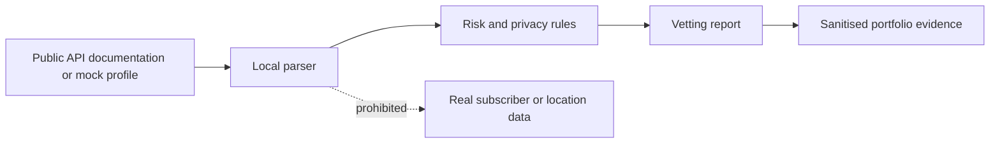

# Privacy Impact Assessment

**Status:** Not started  
**System:** Telco API Vetting Tool  
**Assessment owner:** Luca Sprunt  
**Reviewer:** Raydo

## 1. Project description

Describe the problem, users, intended outcome and why an API-vetting tool is needed.

## 2. Scope and exclusions

Confirm that the MVP assesses documentation, OpenAPI specifications and mock metadata only. Record all prohibited data and activities.

## 3. Stakeholders

| Stakeholder | Role | Privacy interest | Consultation required |
|---|---|---|---|
| Learner | Builds and operates the prototype | Avoid accidental collection or disclosure | Yes |
| Mentor | Approves scope and evidence | Governance and safety | Yes |
| Telco or API provider | Owns portal and API terms | Contractual and platform integrity | Where required |
| Data subject | Person potentially represented by telco data | Privacy, autonomy and safety | Real-person data is excluded |

## 4. Information lifecycle

Document collection, input, processing, output, storage, logging, sharing, retention and deletion.

## 5. Privacy risks

| Risk | Likelihood | Impact | Initial rating | Controls | Residual rating | Owner |
|---|---|---|---|---|---|---|
| Real personal data entered accidentally | | | | Input warnings, mock fixtures and validation | | |
| API key written to logs or repository | | | | Environment variables, secret scanning and redaction | | |
| Report reveals sensitive portal details | | | | Public-source boundary and mentor review | | |
| Risk score creates a misleading compliance claim | | | | Explainable scoring and legal-review disclaimer | | |
| Tool is extended into surveillance use | | | | Scope controls, prohibited-use policy and no production adapters | | |

## 6. Australian Privacy Principles mapping

| APP area | Applicability | Design response | Evidence |
|---|---|---|---|
| Open and transparent management | | | |
| Collection limitation | | | |
| Notification | | | |
| Use and disclosure | | | |
| Cross-border disclosure | | | |
| Data quality | | | |
| Security | | | |
| Access and correction | | | |

## 7. Data minimisation decision

Explain why public documentation and mock metadata are sufficient to meet the learning objective.

## 8. Retention and deletion

Define what is stored, where it is stored, how long it is retained and how it is securely removed.

## 9. Incident and breach response

Document the immediate response if personal information, a token or confidential API material is accidentally introduced.

## 10. Approval

| Reviewer | Decision | Conditions | Date |
|---|---|---|---|
| Luca Sprunt | Self-review pending | | |
| Raydo | Mentor review pending | | |
