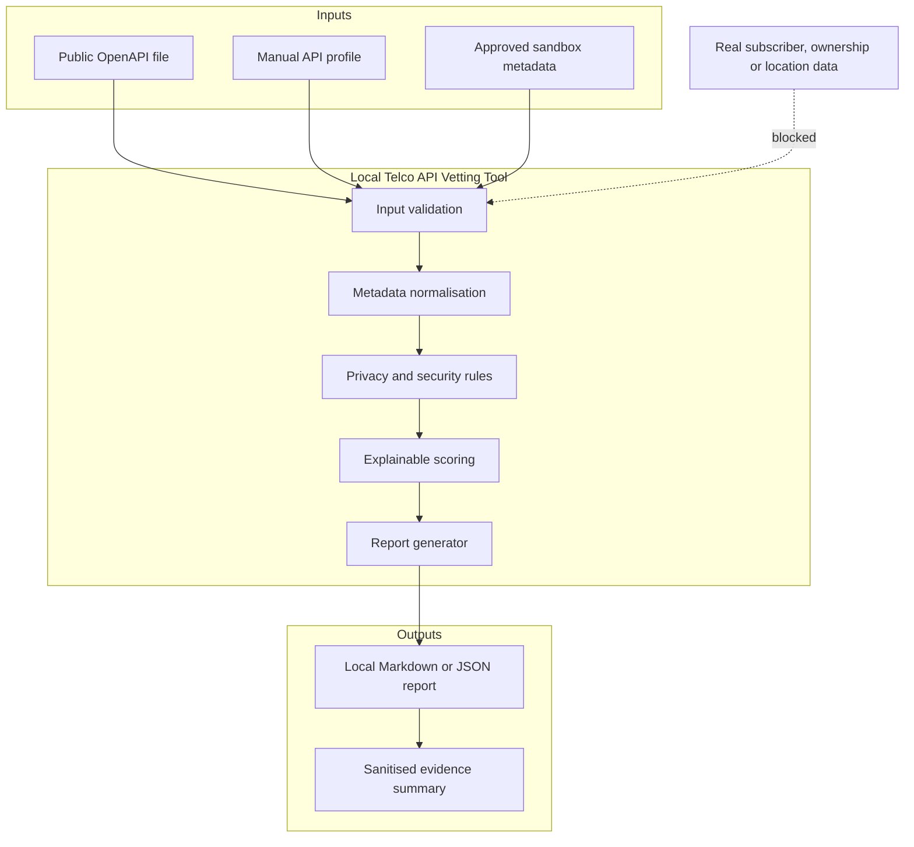

# Secure Architecture and Data-Flow Design

**Status:** Not started

## Architecture goal

Create a local-first, explainable assessment tool that analyses public API specifications and mock metadata without requiring production subscriber access.

## Component register

| Component | Responsibility | Trust level | Security controls |
|---|---|---|---|
| Input validator | Accept supported files and profiles | Untrusted input | Size limits, schema validation, no execution |
| Normaliser | Convert inputs to a common model | Internal | Strict field mapping and safe defaults |
| Rules engine | Apply privacy and API security checks | Trusted code | Versioned rules and unit tests |
| Scoring engine | Calculate transparent score | Trusted code | Explainable weights and no hidden compliance claims |
| Report generator | Produce findings | Internal output | Redaction and source provenance |
| Sandbox adapter | Optional approved sandbox interaction | Restricted | Disabled by default, environment secrets and allow-listing |

## Minimum scoring dimensions

- Identity and access management
- Consent and purpose limitation
- Data sensitivity
- Location and subscriber-information exposure
- Rate limiting and abuse prevention
- Logging and privacy-preserving auditability
- Retention and deletion
- Sandbox and synthetic-data support
- API inventory, lifecycle and versioning
- OWASP API Security Top 10 coverage
- Documentation and incident-response readiness

## Secure defaults

- Local processing by default
- No external telemetry
- No production connector
- No data persistence unless explicitly requested
- Report redaction enabled
- Unknown controls score as unresolved, not compliant
- High-impact data categories trigger a mandatory review gate
- Secrets supplied only through environment variables

## Decision log

| Decision | Options considered | Selected approach | Security/privacy reason | Date |
|---|---|---|---|---|
| Runtime | Python / Node.js | | | |
| Input formats | OpenAPI / JSON / manual form | | | |
| Report formats | Markdown / JSON / HTML | | | |
| Storage | None / local file / database | | | |
| Sandbox support | None / optional adapter | | | |
