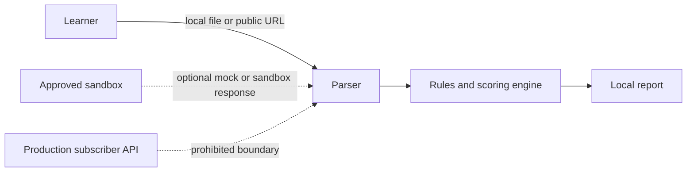

# Threat Model and Abuse-Case Register

**Status:** Not started

## System boundary

The learner MVP processes public API documentation, OpenAPI specifications and synthetic metadata. Production subscriber APIs, real location data, real phone-number ownership checks and production credentials are outside scope.

## Assets

- Public API specifications
- Project scoring rules
- Sanitised assessment reports
- Sandbox credentials held outside the repository
- Learner workstation and development environment
- Evidence and mentor-review records

## Trust boundaries

## STRIDE review

| Threat category | Scenario | Impact | Existing control | Additional action | Status |
|---|---|---|---|---|---|
| Spoofing | A fake portal or specification is assessed as authoritative | Misleading findings or credential theft | Use official domains and record provenance | | Open |
| Tampering | OpenAPI input manipulates parser behaviour | Code execution or corrupted output | Parse as data, validate schema and avoid unsafe evaluation | | Open |
| Repudiation | Assessment changes cannot be traced | Weak evidence and review | Git history and signed-off evidence register | | Open |
| Information disclosure | Tokens or personal data appear in input or logs | Privacy or security breach | Redaction, secret scanning and mock data | | Open |
| Denial of service | Very large or recursive specification consumes resources | Local service failure | File-size, recursion and timeout limits | | Open |
| Elevation of privilege | Tool executes scripts from an uploaded document | Workstation compromise | No dynamic execution; least privilege | | Open |

## API-specific abuse cases

| Abuse case | Required prevention |
|---|---|
| Broken object-level authorisation is ignored in the score | Explicit OWASP API1 checks and evidence field |
| Real phone numbers are submitted to a sandbox | Synthetic test fixtures and input warnings |
| Precise location APIs are normalised as low risk | High-impact classification and mandatory mentor gate |
| API tokens are committed | Environment variables, `.gitignore`, secret scanning and rotation procedure |
| A portal is scraped despite terms restrictions | Manual research or authorised API only |
| The tool is used to identify or track a person | Prohibited-use policy and no production connectors |
| A score is presented as legal certification | Clear disclaimer and explainable findings |
| Reports expose protected documentation | Public-source boundary and publication review |

## Security requirements

- [ ] No `eval`, dynamic code execution or unsafe deserialisation.
- [ ] Input schema, file type and file size are validated.
- [ ] URLs are restricted to explicit user actions and safe protocols.
- [ ] Sandbox tokens are stored outside source control.
- [ ] Logs redact credentials and personal data.
- [ ] Reports identify source provenance and assessment limitations.
- [ ] Tests cover malformed and malicious input.
- [ ] Dependencies are minimal, pinned and reviewed.
- [ ] The tool runs with least privilege.
- [ ] No telemetry is enabled by default.

## Residual-risk decision

Document risks that remain after controls and identify which require mentor approval before demonstration or release.
