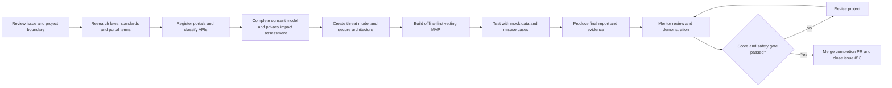

# Australian Telco API Privacy & Security Vetting Lab

  Assigned to Luca
  6-week portfolio project
  30–42 hours
  Mentor approval required

## Project control

| Field | Detail |
|---|---|
| Assignee | [Luca Sprunt](https://github.com/Luca-Sprunt) |
| Status | **Assigned** |
| Tracking issue | [GitHub issue #18](https://github.com/skunkworks-academy/ls1607/issues/18) |
| Duration | **6 weeks** |
| Estimated effort | **30–42 hours** |
| Mentor | Raydo |
| Repository workspace | [`assignments/australian-telco-api-vetting-lab/`](https://github.com/skunkworks-academy/ls1607/tree/main/assignments/australian-telco-api-vetting-lab) |
| Deadline | To be confirmed with mentor |

## What Luca will build

Luca will research Australian telecommunications developer portals and create a **privacy-aware Telco API Vetting Tool**.

The tool will analyse public API documentation, OpenAPI specifications or manually entered mock metadata. It will produce an explainable assessment of privacy, security, consent, documentation and governance readiness.

The project is designed to teach Luca how professional security work begins **before coding or API access**: with legal research, scope control, terms-of-use review, data classification, consent analysis, threat modelling and documented authorisation.

## Safety boundary

:::danger Strict project boundary
This project does not authorise Luca to track people, identify the owner of a phone number or SIM, retrieve real subscriber details, query precise location, intercept communications, bypass consent, scrape protected portals or test production telco systems.
:::

Only these inputs are allowed:

- public developer documentation;
- public OpenAPI specifications;
- manually created API profiles;
- synthetic or mock data;
- an operator-provided sandbox after its terms have been reviewed;
- test accounts and credentials explicitly authorised for the sandbox.

Production subscriber, location, ownership, identity and communications data are excluded.

## Learning outcomes

By the end of the project, Luca should be able to:

- distinguish law, regulatory guidance, contractual portal terms and voluntary standards;
- explain the Australian Privacy Principles relevant to API use;
- recognise telecommunications confidentiality and disclosure risks;
- classify API data by sensitivity and potential harm;
- assess consent, purpose limitation, retention and deletion requirements;
- map API weaknesses to the OWASP API Security Top 10;
- build a threat model and privacy impact assessment;
- design an offline-first, least-privilege assessment tool;
- test safely with mock data;
- produce a defensible security and privacy report;
- communicate unresolved legal or ethical questions instead of guessing.

## Required reference framework

### Australian law and regulatory guidance

- [Privacy Act 1988 and OAIC guidance](https://www.oaic.gov.au/privacy/privacy-legislation/the-privacy-act)
- [Australian Privacy Principles](https://www.oaic.gov.au/privacy/australian-privacy-principles)
- [Notifiable Data Breaches scheme](https://www.oaic.gov.au/privacy/notifiable-data-breaches)
- [Telecommunications Act 1997](https://www.legislation.gov.au/C2004A05145/latest/text)
- Relevant developer-portal terms, privacy notices and acceptable-use rules

### Security and privacy standards

- [ASD Information Security Manual](https://www.cyber.gov.au/business-government/asds-cyber-security-frameworks/ism)
- [Essential Eight](https://www.cyber.gov.au/business-government/asds-cyber-security-frameworks/essential-eight)
- [OWASP API Security Top 10](https://owasp.org/API-Security/)
- ISO/IEC 27001, 27002, 27701 and 29100 concepts
- NIST Cybersecurity Framework and Privacy Framework
- [GSMA Open Gateway](https://www.gsma.com/solutions-and-impact/technologies/networks/gsma-open-gateway/)
- CAMARA API and consent patterns where relevant

:::info Research expectation
Luca must record the source, authority, date accessed and whether each item is mandatory law, regulator guidance, contractual obligation or voluntary good practice. This project does not replace qualified legal advice.
:::

## Project workflow

## Six-week timetable

| Week | Hours | Focus | Required evidence |
|---|---:|---|---|
| 1 | 5–7 | Australian law, privacy and ethical-use research | Legal and standards matrix |
| 2 | 5–7 | Telco developer portals and API inventory | Portal register, terms review and API categories |
| 3 | 5–7 | Data classification, consent and privacy engineering | Consent matrix and privacy impact assessment |
| 4 | 5–7 | Threat modelling, architecture and scoring rules | Threat model, data flow and secure design |
| 5 | 5–7 | MVP implementation and automated testing | Working CLI, mock fixtures and test results |
| 6 | 5–7 | Final vetting report, demonstration and review | Evidence register, report and mentor score |

## Deliverables

### 1. Legal and standards matrix

Separate mandatory requirements from guidance and record unresolved questions.

### 2. Telco developer-portal inventory

For each provider, record only public or authorised information such as:

- portal URL;
- available API categories;
- public documentation status;
- sandbox availability;
- authentication model;
- consent requirements;
- data categories;
- production approval requirements;
- rate limits;
- terms and privacy notice review.

Never record passwords, tokens, client secrets or private account details.

### 3. Data classification and consent model

Classify public metadata, personal data, precise location, subscriber identity, communications data and secrets. Explain when processing is prohibited.

### 4. Privacy impact assessment

Document the information lifecycle, stakeholders, privacy risks, Australian Privacy Principles mapping, data minimisation and deletion decisions.

### 5. Threat model

Cover malicious input, secret leakage, misleading compliance scores, unsafe OpenAPI parsing, unauthorised API use and surveillance misuse.

### 6. Secure architecture

Design a local-first tool with no telemetry, no production connector, no default persistence and explainable findings.

### 7. Functional MVP

The MVP should accept an OpenAPI file or mock API profile and assess:

- authentication;
- authorisation;
- consent;
- data sensitivity;
- location and subscriber exposure;
- rate limiting;
- logging and retention;
- sandbox support;
- API inventory and lifecycle;
- relevant OWASP API Security risks.

### 8. Testing

Use synthetic fixtures and include malformed input, fake secret patterns, high-risk location profiles, incomplete documentation and offline-operation tests.

### 9. Final report and demonstration

Present the findings, limitations, recommendations, evidence and unresolved legal or operator questions.

## Success measurement

| Criterion | Weight | Evidence expected |
|---|---:|---|
| Legal and regulatory research | 20% | Accurate source matrix and mandatory-versus-guidance distinction |
| Privacy, ethics and consent design | 15% | Consent analysis, privacy boundary and PIA |
| API inventory and data classification | 15% | Structured portal inventory and risk classification |
| Threat model and secure architecture | 20% | Abuse cases, data flow, controls and residual risks |
| Functional MVP | 15% | Explainable assessment engine using safe inputs |
| Testing and evidence quality | 10% | Automated tests, mock fixtures and reproducible evidence |
| Documentation and presentation | 5% | Clear report, README and demonstration |
| **Total** | **100%** | |

### Grade bands

| Score | Result |
|---:|---|
| 85–100 | Distinction — strong technical, privacy and governance maturity |
| 70–84 | Pass — project meets the required outcomes and safety controls |
| 60–69 | Revision required — material gaps remain |
| Below 60 | Incomplete — substantial rework required |

### Critical safety gate

Regardless of the numerical score, the project is placed on hold if it includes:

- unauthorised access or testing;
- tracking or identifying a real person;
- real subscriber, ownership or precise-location data;
- exposed credentials or tokens;
- deliberate breach of portal terms;
- misleading claims of legal compliance or certification.

## Start the project

1. Open [issue #18](https://github.com/skunkworks-academy/ls1607/issues/18).
2. Open the [project workspace](https://github.com/skunkworks-academy/ls1607/tree/main/assignments/australian-telco-api-vetting-lab).
3. Complete the legal and ethical research before registering production applications or writing integrations.
4. Create `assignment/australian-telco-api-vetting-lab` for Luca's work.
5. Use `Closes #18` only in the final reviewed completion pull request.
