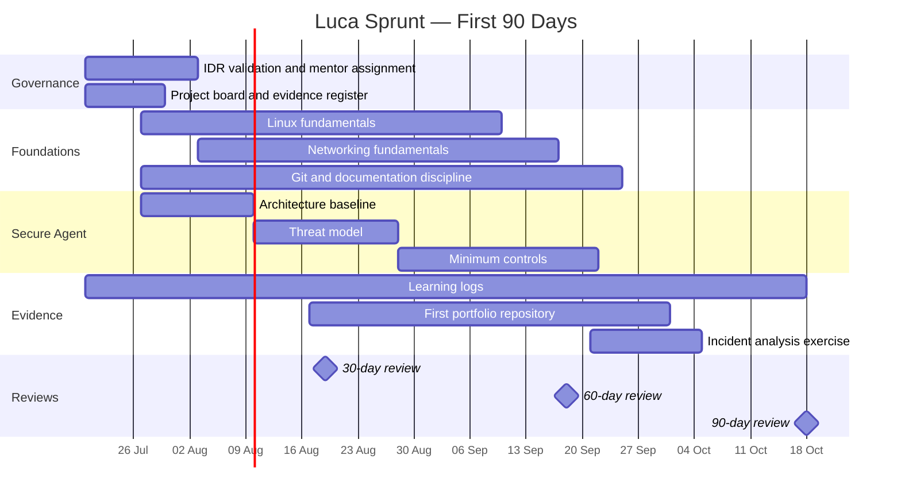
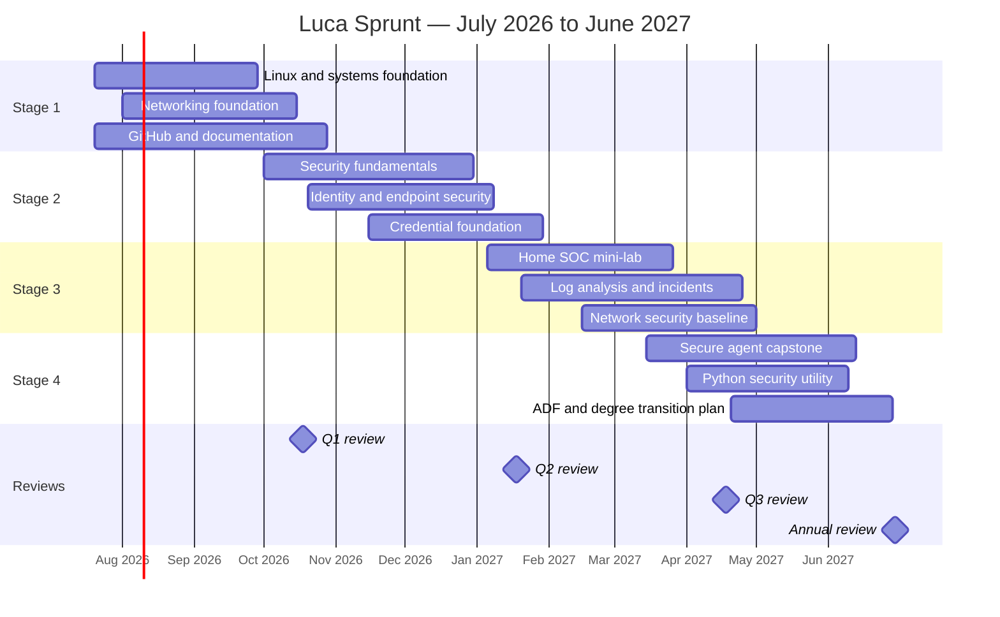

# 90-Day and 12-Month Execution Roadmap

## First 30 days

**Objective:** Establish structure, baseline capability and a repeatable learning system.

- Conduct the IDR validation consultation.
- Assign a cybersecurity mentor.
- Agree on a sustainable weekly time allocation.
- Create the GitHub project board and evidence register.
- Publish a professional GitHub profile README.
- Create the private cyber lab repository.
- Baseline Linux, networking and security knowledge.
- Document the current OpenClaw architecture and access paths.
- Begin weekly learning logs.

**30-day evidence gate**

- Project board operational
- Mentor assigned and first two sessions completed
- At least four learning logs
- Initial architecture diagram and risk notes
- Five practical foundation labs

## Days 31–60

**Objective:** Build foundation depth and secure the current agent environment.

- Complete structured Linux and networking learning units.
- Implement initial OpenClaw safeguards.
- Produce a basic threat model.
- Start the first public portfolio repository.
- Complete a minimum of five additional labs.
- Participate in at least one cybersecurity community or peer session.
- Receive mentor feedback on technical documentation.

**60-day evidence gate**

- Ten cumulative practical labs
- Secure-agent baseline controls implemented
- Threat model reviewed
- First public project repository active
- Technical writing improvement visible

## Days 61–90

**Objective:** Demonstrate applied competence and confirm the next six-month path.

- Complete the first portfolio project.
- Perform an introductory incident-analysis exercise.
- Produce a network diagram and security baseline.
- Complete a credential diagnostic or practice assessment.
- Hold the 90-day formal review.
- Confirm the next-stage learning sequence and credential target.

**90-day evidence gate**

- One completed and documented portfolio project
- At least fifteen cumulative labs
- One incident report
- Credential readiness decision recorded
- Updated six-month roadmap approved

## Weekly cadence

| Activity | Suggested allocation | Evidence |
|---|---:|---|
| Structured study | 2 sessions | Notes and completed modules |
| Practical lab | 1–2 sessions | Screenshots, commands, findings or lab report |
| Portfolio work | 1 session | Commit, issue update or documentation improvement |
| Mentor or peer review | 30–45 minutes | Review note and actions |
| Weekly reflection | 15 minutes | Learning log |

:::note Workload validation
The exact hours must be confirmed with Luca because the copied assessment did not preserve the selected weekly-time responses. The cadence must protect Year 12 commitments and remain sustainable.
:::

## 90-day timeline

## 12-month execution roadmap

## Review gates

| Gate | Decision focus | Minimum evidence |
|---|---|---|
| 30 days | Is the learning system operational? | Board, mentor, baseline, logs and five labs |
| 60 days | Are foundations and controls improving? | Ten labs, threat model, agent controls and active repository |
| 90 days | Is Luca ready for Stage 2? | Completed project, incident note, network baseline and diagnostic |
| 6 months | Is a credential attempt justified? | Practical evidence, practice results and mentor approval |
| 9 months | Is portfolio evidence credible? | Two documented projects and demonstration capability |
| 12 months | What is the next development track? | KPI review, portfolio review, ADF alignment and revised IDR |
