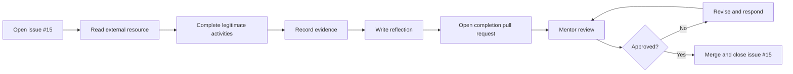

# Foundation Task — GitHub Achievements Academy

  Assigned to Luca
  Foundation task
  30–60 minutes
  Mentor review required

## Task control

| Field | Detail |
|---|---|
| Assignee | [Luca Sprunt](https://github.com/Luca-Sprunt) |
| Status | **Assigned** |
| Tracking issue | [GitHub issue #15](https://github.com/skunkworks-academy/ls1607/issues/15) |
| Task workspace | [`assignments/github-achievements-academy/`](https://github.com/skunkworks-academy/ls1607/tree/main/assignments/github-achievements-academy) |
| External resource | [Puliczek/github-achievements-academy](https://github.com/Puliczek/github-achievements-academy) |
| Mentor | Raydo |
| Deadline | To be confirmed with mentor |

## Purpose

This short task builds practical GitHub fluency. Luca will use an external learning resource, complete legitimate GitHub activities, record evidence and submit a reflection through the same issue–branch–commit–pull-request workflow used for larger portfolio projects.

The external project describes itself as a short activity for learning more about GitHub and earning profile achievements. Achievement availability and award rules are controlled by GitHub and can change. The assessed outcome is therefore **demonstrated GitHub workflow competence**, not a guaranteed number of badges.

## Learning outcomes

By completing the task, Luca should be able to:

- navigate and assess an external GitHub repository;
- follow repository documentation;
- use issues to track assigned work;
- create a branch and meaningful commits;
- open and update a pull request;
- respond to mentor review feedback;
- record safe public evidence;
- explain how GitHub achievements relate to genuine platform activity.

## Required actions

1. Read the [external repository](https://github.com/Puliczek/github-achievements-academy).
2. Open the learning site referenced in its README.
3. Complete only legitimate, safe and relevant activities.
4. Record the GitHub features used.
5. Complete the [learning reflection](https://github.com/skunkworks-academy/ls1607/blob/main/assignments/github-achievements-academy/reflection.md).
6. Update the [evidence register](https://github.com/skunkworks-academy/ls1607/blob/main/assignments/github-achievements-academy/evidence/README.md).
7. Submit the work through a pull request linked to issue #15.

## Workflow

## Evidence required

| Evidence | Requirement |
|---|---|
| Reflection | Explain what was completed and learned |
| Feature list | Identify GitHub features practised |
| Public links | Include appropriate links to issues, commits or pull requests |
| Achievement evidence | Optional; record only badges visibly awarded by GitHub |
| Mentor review | Record feedback and final approval |

## Integrity and safety controls

:::caution Legitimate activity only
Do not create spam issues, comments, repositories, reactions or pull requests merely to manipulate profile achievements. Do not involve unrelated users without consent.
:::

- Never expose credentials, tokens, personal data or private repository content.
- Use meaningful activity connected to actual learning.
- Follow GitHub's applicable terms, acceptable-use requirements and community standards.
- Treat badges as secondary evidence, not the primary goal.
- Keep all evidence accurate and suitable for public review.

## Definition of done

- [ ] The external resource has been reviewed.
- [ ] Legitimate GitHub activities have been completed.
- [ ] The reflection is complete.
- [ ] The evidence register contains valid public links.
- [ ] No sensitive information or spam activity is present.
- [ ] Repository validation passes.
- [ ] Mentor feedback is resolved.
- [ ] The final pull request includes `Closes #15` and is approved and merged.

## Start now

- [Open issue #15](https://github.com/skunkworks-academy/ls1607/issues/15)
- [Open the task workspace](https://github.com/skunkworks-academy/ls1607/tree/main/assignments/github-achievements-academy)
- [Open the external GitHub Achievements Academy repository](https://github.com/Puliczek/github-achievements-academy)
