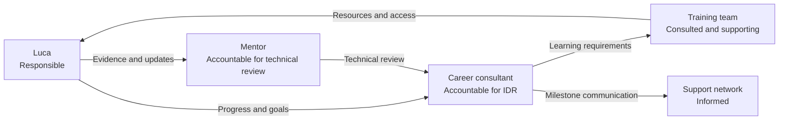

# Objectives, Governance and Risks

## Development objectives

| ID | Objective | Desired outcome | Target date |
|---|---|---|---|
| O1 | Establish technical foundations | Confident Linux, networking and Git/GitHub use | October 2026 |
| O2 | Build cybersecurity baseline | Demonstrate security concepts through labs and reports | January 2027 |
| O3 | Produce practical evidence | Publish at least two complete portfolio projects | April 2027 |
| O4 | Secure the OpenClaw environment | Implement reviewed minimum controls and threat model | May 2027 |
| O5 | Validate credential readiness | Earn one credential or approved equivalent milestone | June 2027 |
| O6 | Prepare career transition | Complete ADF and degree alignment plan | June 2027 |

## Roles and responsibilities

| Role | Responsibility |
|---|---|
| Luca | Complete agreed work, maintain evidence, communicate blockers and apply feedback |
| Mentor | Review evidence, identify gaps, protect scope and approve progression decisions |
| Career consultant | Maintain IDR alignment, coordinate review gates and update career direction |
| Training team | Provide learning access, administration, cohort opportunities and quality controls |
| Parent or support network | Support sustainable time allocation and wellbeing where appropriate |

### RACI view

## Risks and mitigations

| Risk | Likelihood | Impact | Mitigation | Owner |
|---|:---:|:---:|---|---|
| Too many simultaneous interests | High | Medium | Maintain one primary pathway and one secondary capstone | Luca / Mentor |
| Year 12 workload conflict | Medium | High | Use sustainable weekly allocation and pause optional work during exams | Luca / Support network |
| Lack of direction or peers | High | High | Assign mentor and monthly community exposure | Career consultant |
| Unsafe remote-agent configuration | Medium | High | Apply secure-agent control baseline before feature expansion | Luca / Mentor |
| Credential attempted too early | Medium | Medium | Require diagnostic evidence and mentor approval | Mentor |
| Portfolio exposes private data | Medium | High | Use sanitisation checklist and review before publication | Luca / Mentor |
| Inconsistent documentation | Medium | Medium | Weekly logs, templates and evidence acceptance criteria | Luca |
| ADF transition disrupts cadence | Medium | Medium | Rebaseline the IDR before programme commencement | Career consultant |

## Review and change control

The IDR is a controlled development plan. Changes should be recorded when:

- Luca’s ADF dates or responsibilities are confirmed
- Available learning hours change materially
- A credential is achieved or abandoned
- A major project is completed
- A new risk affects the development path
- Mentor evidence changes the provisional placement
- University or employment decisions become concrete

## Immediate next actions

| Priority | Action | Owner | Target |
|---:|---|---|---|
| 1 | Validate the complete IDR and missing assessment selections | Luca + Career consultant | First consultation |
| 2 | Assign a suitable cybersecurity mentor | Skunkworks Academy | Within 7 days |
| 3 | Agree sustainable weekly learning hours | Luca + Mentor | Within 7 days |
| 4 | Create the GitHub project board and evidence register | Luca | Within 10 days |
| 5 | Baseline Linux, networking and security skills | Mentor | Within 14 days |
| 6 | Document OpenClaw architecture and access | Luca | Within 14 days |
| 7 | Complete the first five foundation labs | Luca | Within 30 days |
| 8 | Hold formal 30-day review | All required reviewers | Day 30 |

## Annual success indicators

At the end of twelve months, Luca should be able to show:

- Thirty or more completed practical labs
- Two or three credible repositories
- Six or more accepted technical write-ups or reports
- A secure-agent threat model and control baseline
- At least twelve meaningful peer interactions
- Regular mentor-review records
- One credential or approved equivalent learning milestone
- A documented transition plan for ADF experience and cybersecurity degree study
