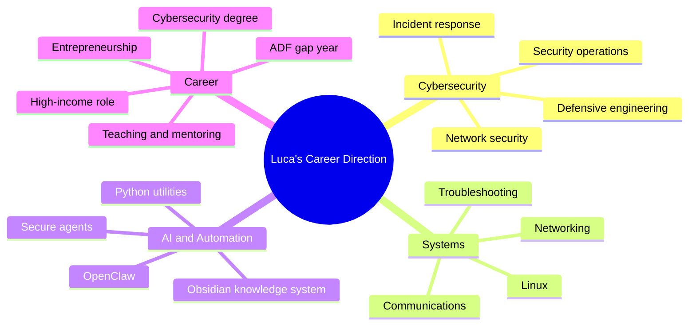

# Luca Sprunt — Individual Development Roadmap

**Cybersecurity Foundations · Systems Operations · Secure AI Automation**

  Track · Foundation Technical
  Primary · Cybersecurity Foundations
  Duration · 12 Months
  Reviews · 30 · 60 · 90 Days
  Status · In Progress

**Prepared by:** Skunkworks Academy — Training and Career Development  
**Roadmap period:** July 2026–June 2027  
**Primary contact:** [training@skunkworksacademy.com](mailto:training@skunkworksacademy.com)

:::caution Confidential development record
This roadmap contains personal development information. Access should be limited to Luca, his assigned mentor, the career consultant and authorised Skunkworks Academy personnel. Personal phone and private contact details are intentionally excluded from this public documentation site.
:::

:::note Validation requirement
Several single-choice answers were not preserved in the copied Microsoft Forms export. The roadmap prioritises Luca’s written responses and must be validated during the first career consultation.
:::

## Executive summary

Luca is a **high-potential emerging learner** at the beginning of his technical career. His strongest indicators are initiative, curiosity, coachability and long-term ambition. He has completed VCE Software Development 3/4, developed basic Python capability, begun Linux fundamentals, explored TryHackMe and initiated a locally hosted OpenClaw assistant integrated with an Obsidian vault.

His primary development requirement is not motivation. It is **structure**: a sequenced foundation in Linux, networking, security operations, technical documentation and safe systems engineering.

### Provisional placement

| Dimension | Placement |
|---|---|
| Development level | **Foundation Technical — High-Potential Emerging Learner** |
| Primary pathway | **Cybersecurity Foundations and Security Operations** |
| Secondary pathway | **Secure AI Automation and Technical Entrepreneurship** |
| Mentoring requirement | **High** |
| Core constraint | Year 12 workload and limited access to cybersecurity peers |
| Anchor capstone | **Secure Personal Agent Baseline** |

### One-year North Star

> By July 2027, Luca should have a documented cybersecurity foundation, an active and credible GitHub portfolio, two to three practical projects, at least one entry-level credential or equivalent validated learning milestone, regular mentor feedback, and a clear transition plan into the ADF communications environment and subsequent cybersecurity degree.

## Candidate snapshot

| Field | Detail |
|---|---|
| Name | Luca Sprunt |
| Current stage | Scholar / Year 12 learner |
| Primary interest | Cybersecurity |
| Related interests | AI, coding, Linux, automation, GitHub and systems operations |
| GitHub | [github.com/Luca-Sprunt](https://github.com/Luca-Sprunt) |
| LinkedIn | [linkedin.com/in/luca-sprunt-008a99417](https://www.linkedin.com/in/luca-sprunt-008a99417) |
| Credly | [credly.com/users/luca-sprunt](https://www.credly.com/users/luca-sprunt) |
| Portfolio status | Public portfolio requires development |
| Current project | Locally hosted OpenClaw assistant connected to an Obsidian knowledge vault |

## Career direction

### Immediate: next 12–24 months

- Complete Year 12 successfully.
- Build coherent Linux, networking and cybersecurity foundations.
- Establish a credible GitHub portfolio.
- Gain regular access to a cybersecurity mentor and peer cohort.
- Prepare for the ADF gap-year Communications Systems Operator programme.

### Medium term: 3–5 years

- Start and progress through a cybersecurity degree.
- Become credible in a defined security specialisation.
- Move toward a high-income technical role.
- Test and validate a viable technology business concept.

### Long term: 5+ years

- Complete the cybersecurity degree.
- Attain specialist and leadership capability.
- Operate a sustainable technology business.
- Teach, mentor and eventually employ others.

## IDR documents

- [Download the editable Word IDR](https://github.com/skunkworks-academy/ls1607/raw/main/docs/Luca_Sprunt_Individual_Development_Roadmap.docx)
- [Open the GitHub repository](https://github.com/skunkworks-academy/ls1607)

## Next section

Continue to the [development profile](./profile) for Luca’s readiness baseline, strengths and priority gaps.
