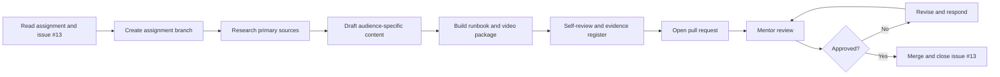

# Portfolio Assignment 5 — OWASP Top 10 2025 Content Sprint

<div className="idr-badges">
  <span className="idr-badge">Assigned to Luca</span>
  <span className="idr-badge">Portfolio Project 5</span>
  <span className="idr-badge">Mentor review required</span>
  <span className="idr-badge">Deadline to be confirmed</span>
</div>

## Assignment control

| Field | Detail |
|---|---|
| Assignee | [Luca Sprunt](https://github.com/Luca-Sprunt) |
| Status | **Assigned** |
| Tracking issue | [GitHub issue #13](https://github.com/skunkworks-academy/ls1607/issues/13) |
| Repository workspace | [`assignments/owasp-top-10-2025-content-sprint/`](https://github.com/skunkworks-academy/ls1607/tree/main/assignments/owasp-top-10-2025-content-sprint) |
| Primary reference | [OWASP Top 10:2025](https://owasp.org/Top10/2025/) |
| Mentor review | Raydo |
| Deadline | To be confirmed with mentor |

## Purpose

This project converts application-security research into portfolio evidence. Luca must demonstrate that he can explain technical risk accurately, connect security issues to business impact, communicate to different audiences, structure incident-response guidance and manage work through a professional GitHub workflow.

## Learning outcomes

By completing the sprint, Luca should be able to:

- explain each OWASP Top 10:2025 risk in clear language;
- distinguish vulnerability, threat, business impact and control response;
- adapt the same technical subject for learner, executive and practitioner audiences;
- produce a defensive web application incident-response runbook;
- cite primary sources and separate facts from opinion;
- use issues, branches, commits, pull requests and review feedback as evidence;
- publish portfolio work without exposing secrets or personal information.

## Required deliverables

### 1. Skunkworks Academy blog article

**Audience:** Learners and aspiring cybersecurity professionals  
**Topic:** OWASP Top 10 2025 for students and entry-level practitioners

### 2. Skunkworks Africa blog article

**Audience:** Executives, SMB owners and IT managers  
**Topic:** Business impact of OWASP Top 10 risks

### 3. Skunkworks Insights newsletter article

**Audience:** Technology leaders, practitioners and partners  
**Topic:** Key organisational takeaways from OWASP Top 10 2025

### 4. LinkedIn thought-leadership article

**Topic:** **Why OWASP still matters in an AI-powered world**

### 5. Email newsletter campaign

Produce a concise customer-facing awareness campaign with subject-line options, preview text, message body and one clear call to action.

### 6. Presenter-recorded video package

Prepare a 5–10 minute explainer titled **OWASP Top 10 2025 Explained in 10 Minutes**, including:

- presenter script;
- slide outline;
- recording checklist;
- captions or transcript planning.

### 7. Cybersecurity incident-response runbook

Create a practical web application incident-response runbook mapped to OWASP risks, covering:

- preparation;
- identification and severity classification;
- containment;
- eradication;
- recovery;
- evidence handling;
- stakeholder communication;
- lessons learned and corrective actions.

### 8. Evidence register

Maintain links to commits, pull requests, publication previews, sources, decisions and mentor feedback.

## Repository structure

```text
assignments/owasp-top-10-2025-content-sprint/
├── README.md
├── assignment.yml
├── blog-articles/
│   ├── skunkworks-academy-article.md
│   └── skunkworks-africa-article.md
├── newsletter/
│   ├── skunkworks-insights-newsletter.md
│   └── email-newsletter-campaign.md
├── linkedin/
│   └── linkedin-thought-leadership-article.md
├── video/
│   ├── presenter-script.md
│   └── slide-outline.md
├── runbook/
│   └── web-application-incident-response-runbook.md
└── evidence/
    └── README.md
```

## Execution workflow



## Suggested work sequence

| Sprint | Focus | Evidence |
|---|---|---|
| 1 | Research, source register and outline | Source list, issue update and content outlines |
| 2 | Learner and business articles | Two reviewed article drafts |
| 3 | Newsletter, email and LinkedIn content | Three audience-specific assets |
| 4 | Video script and slide outline | Timed script and accessible slide plan |
| 5 | Incident-response runbook | Reviewed operational runbook |
| 6 | Final quality review and pull request | Evidence register, CI pass and mentor approval |

The mentor will confirm the calendar dates and final deadline.

## Quality rubric

| Criterion | Weight | Evidence expected |
|---|---:|---|
| Technical accuracy and source quality | 25% | Correct risk explanations and primary citations |
| Audience adaptation and clarity | 20% | Distinct learner, executive and practitioner treatments |
| Business and operational relevance | 15% | Clear impact, governance and response implications |
| Incident-response runbook quality | 20% | Logical, safe and actionable lifecycle guidance |
| GitHub workflow and portfolio evidence | 10% | Issues, commits, pull request and evidence register |
| Presentation, accessibility and editorial quality | 10% | Clear structure, readable content and accessible media plan |

## Safety and privacy controls

:::caution Public repository boundary
Do not commit passwords, tokens, private keys, personal data, confidential records, raw sensitive logs or identifying infrastructure details. Use sanitised examples and authorised, non-destructive scenarios only.
:::

- Do not perform testing against systems without explicit authorisation.
- Do not publish exploit instructions that materially enable misuse.
- Keep technical examples defensive and focused on detection, mitigation and response.
- Cite primary sources and verify all external links.
- Distinguish observed facts, assumptions and recommendations.

## Definition of done

- [ ] All required working files contain publication-ready content.
- [ ] Each deliverable addresses its defined audience and purpose.
- [ ] Sources are cited and recorded in the evidence register.
- [ ] The incident-response runbook is reviewed for operational logic and safety.
- [ ] No sensitive or personal information is present.
- [ ] Repository validation and production build checks pass.
- [ ] The pull request links to issue #13 using `Closes #13`.
- [ ] Mentor feedback is resolved and the pull request is approved.

## Start the assignment

1. Open [issue #13](https://github.com/skunkworks-academy/ls1607/issues/13).
2. Open the [assignment workspace](https://github.com/skunkworks-academy/ls1607/tree/main/assignments/owasp-top-10-2025-content-sprint).
3. Create the working branch and complete the templates in sequence.
