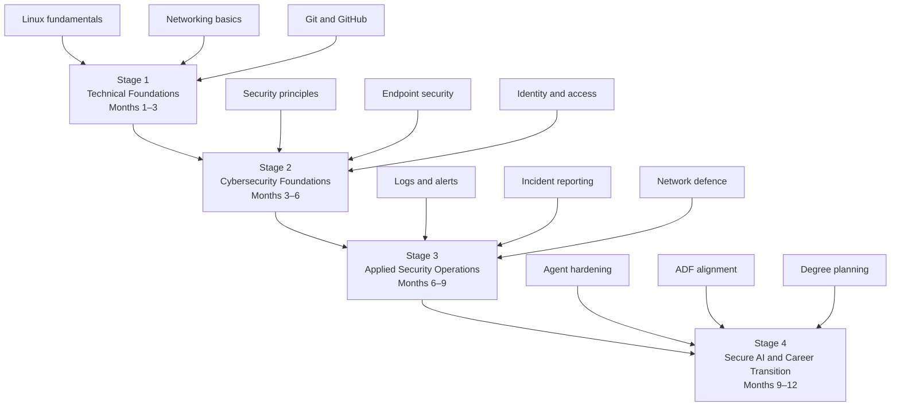
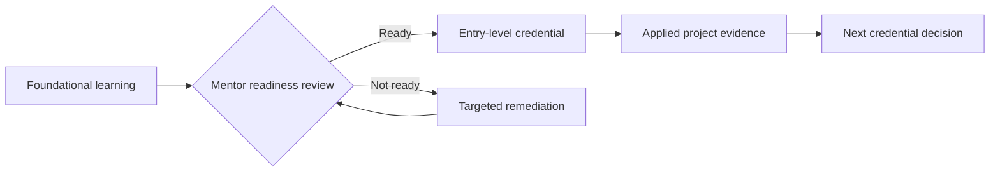

# Recommended Learning Pathway

The roadmap uses a **foundation-first progression**. Each stage produces evidence and has an exit gate before Luca moves into the next stage.

## Stage 1 — Technical Foundations

**Target period:** Months 1–3

### Focus

- Linux fundamentals and command-line navigation
- Files, permissions, processes, services and package management
- TCP/IP, addressing, DNS, DHCP, ports and common protocols
- Git and GitHub workflow
- Structured troubleshooting and technical note-taking

### Required outputs

- A private cyber lab repository
- A public GitHub profile README
- Weekly learning logs
- A basic network diagram
- Ten completed Linux or networking labs
- A documented baseline of the OpenClaw environment

### Exit gate

Luca can explain and demonstrate essential Linux and networking concepts without relying entirely on step-by-step instructions.

## Stage 2 — Cybersecurity Foundations

**Target period:** Months 3–6

### Focus

- Confidentiality, integrity and availability
- Risk, threats, vulnerabilities and controls
- Identity and access management
- Endpoint and network security
- Basic cryptography and data protection
- Incident-response lifecycle
- Entry-level security labs

### Recommended learning targets

- Cisco CCST Cybersecurity learning pathway or equivalent foundation
- Microsoft Security, Compliance and Identity Fundamentals learning content
- TryHackMe foundational rooms selected by the mentor
- CompTIA Security+ concepts as a reference framework rather than an immediate exam requirement

### Exit gate

Luca can assess a small environment, identify basic weaknesses, recommend controls and document the result coherently.

## Stage 3 — Applied Security Operations

**Target period:** Months 6–9

### Focus

- Log sources and event interpretation
- Alert validation and triage
- Network and endpoint hardening
- Incident notes, timelines and evidence
- Basic detection engineering concepts
- Vulnerability remediation workflow
- Communication under operational constraints

### Required outputs

- Home SOC mini-lab
- At least two incident reports
- A hardened host checklist
- A repeatable log-analysis exercise
- A mentor-reviewed demonstration

### Exit gate

Luca can collect evidence, interpret a basic alert, explain impact, document actions and propose remediation.

## Stage 4 — Secure AI and Career Transition

**Target period:** Months 9–12

### Focus

- Secure local-agent architecture
- Python automation and API safety
- Data protection and minimum privilege
- Prompt-injection and untrusted-content controls
- Audit logging and change management
- ADF experience mapping
- Cybersecurity degree and career planning

### Required outputs

- Threat model for the OpenClaw agent
- Security control checklist and operating procedure
- Python security utility
- ADF transition evidence pack
- Twelve-month portfolio review
- Next-stage career and study plan

### Exit gate

Luca can defend the design decisions in his secure-agent project, demonstrate practical controls and link his evidence to future study and employment outcomes.

## Credential sequence

| Sequence | Credential or milestone | Purpose | Readiness requirement |
|---:|---|---|---|
| 1 | GitHub Foundations learning objectives | Version control, collaboration and portfolio discipline | Active repositories and consistent commits |
| 2 | Cisco CCST Cybersecurity or equivalent | Entry-level cybersecurity validation | Networking and security foundation evidence |
| 3 | Microsoft SC-900 learning objectives | Identity, security, compliance and Microsoft cloud concepts | Basic cloud and IAM understanding |
| 4 | CompTIA Security+ pathway | Broader security baseline | Mentor approval after practical evidence and practice performance |
| 5 | Role-specific credential | Align with ADF experience and degree direction | Defined specialisation and verified need |

:::tip Credential rule
Do not schedule an exam solely because a date has arrived. The credential readiness gate requires practical evidence, consistent practice results and mentor approval.
:::
