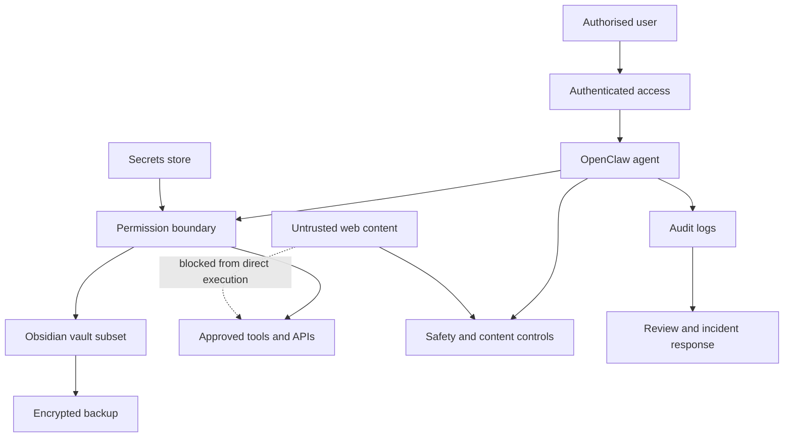

# Secure-Agent Minimum Controls

The OpenClaw assistant is Luca’s anchor capstone and also the highest-risk part of the roadmap. It must be operated as a bounded system, not as an unrestricted convenience tool.

## Control baseline

| Control area | Minimum requirement | Evidence |
|---|---|---|
| Authentication | Strong authentication for every remote access path | Access configuration and test result |
| Secrets | Secrets stored outside code and Obsidian notes | Secret-storage design and repository scan |
| Least privilege | Agent and tools receive only required permissions | Permission matrix |
| Data scope | Only an approved vault subset is accessible | Data inventory and exclusion rules |
| Encryption | Encrypted transport for remote access and encrypted backup where appropriate | Configuration evidence |
| Audit logging | Log material actions, failures and configuration changes | Sanitised audit sample |
| Prompt-injection defence | Treat retrieved and web content as untrusted instructions | Test cases and documented boundaries |
| Tool approval | High-impact tools require explicit human confirmation | Tool-policy configuration |
| Backup and recovery | Tested backup and restore procedure | Restore-test record |
| Patch management | Defined update and vulnerability-review cadence | Maintenance log |
| Incident response | Containment, credential rotation and recovery steps | Agent incident runbook |
| Privacy | Avoid unnecessary personal data and prevent public disclosure | Data-handling statement |

## Prohibited operating patterns

- Storing credentials or tokens directly in source files, prompts or public notes
- Exposing unauthenticated remote administration
- Allowing the agent unrestricted shell or file-system access
- Giving untrusted web content direct authority to invoke tools
- Synchronising sensitive personal material without explicit classification
- Logging complete secrets, private messages or unnecessary personal data
- Publishing configuration files before sanitisation

## Threat-model questions

1. What assets can the agent read, change, transmit or delete?
2. Which identities and credentials does it use?
3. What happens when retrieved content contains malicious instructions?
4. Which tools can create irreversible impact?
5. How is access revoked if the phone or host is compromised?
6. How can Luca identify an unauthorised action?
7. Which records support investigation and recovery?
8. What information must never be available to the agent?

## Human-confirmation boundary

The following actions should require explicit confirmation:

- Sending external messages
- Changing files outside the approved workspace
- Installing software or packages
- Executing privileged commands
- Accessing new data sources
- Publishing content
- Deleting data
- Rotating or modifying credentials

## Security review cadence

| Frequency | Review activity |
|---|---|
| Weekly | Review failed access, unusual actions and configuration changes |
| Monthly | Patch dependencies, review permissions and inspect secrets exposure |
| Quarterly | Repeat threat model, restore test and access-path review |
| After major change | Perform targeted security review before production use |
